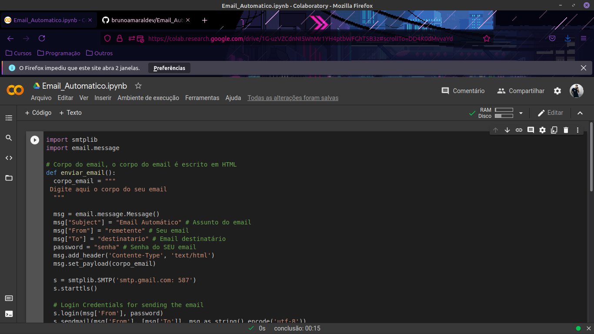
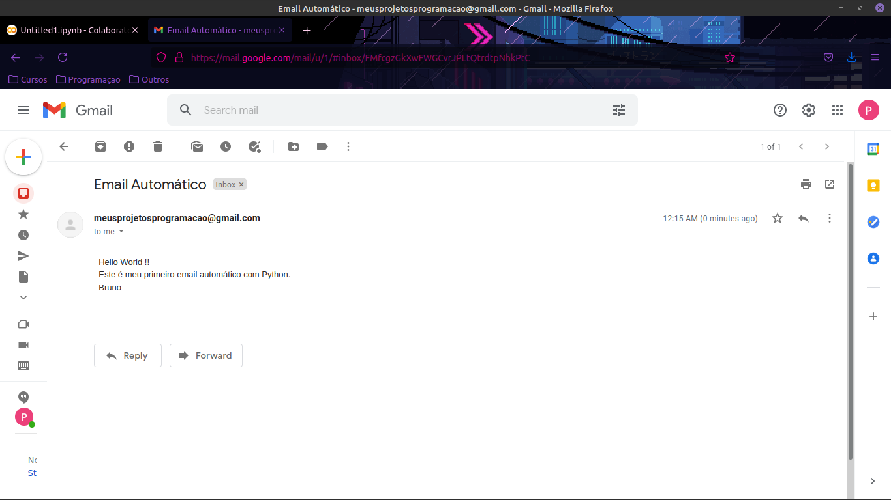

# Envio de email automático em Python 🐍
Código  em Python para automatizar o envio de emails (pelo Gmail, sem necessitar o uso de outlook), utilizando as bibliotecas 'smtplib' e 'email.message'.

---

